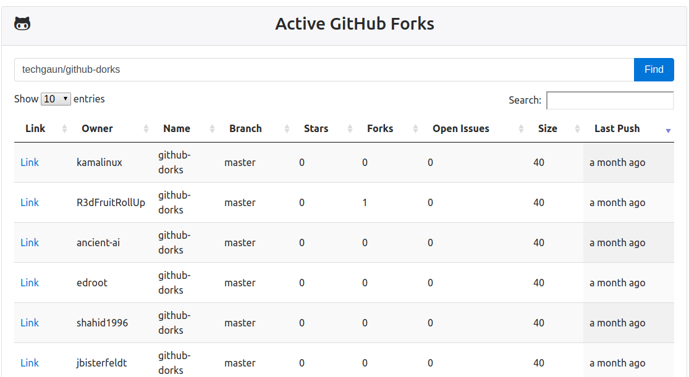

# active-forks

> Find the active github forks of a project

This project allows you to find the most active forks of a repository.

[Find Active Fork](https://techgaun.github.io/active-forks/index.html)

## As Bookmarklet

If you would like to use this tool as a bookmarklet,
you can do so by saving the following javascript code as the bookmarklet.
Since Github doesn't allow javascript in its markdown, you can add it manually.
Hit `Ctrl+D` to create a new bookmark and paste the javascript below into the URL
or "Location" entry (you may have to click "More" to see the URL field).
Any time you're on a Github repo you can click the bookmarklet
and it'll bring up the Active Forks of that repo.

```javascript
javascript:thing=document.URL.match(/github.com\/([A-z][\w\-]*\/[A-z][\w\-]*)/);if (thing){var newPage = 'https://techgaun.github.io/active-forks/index.html#'+thing[1];open(newPage%20,'targetname')%20}%20else%20{window.alert("Not%20a%20valid%20GitHub%20page");}
```


